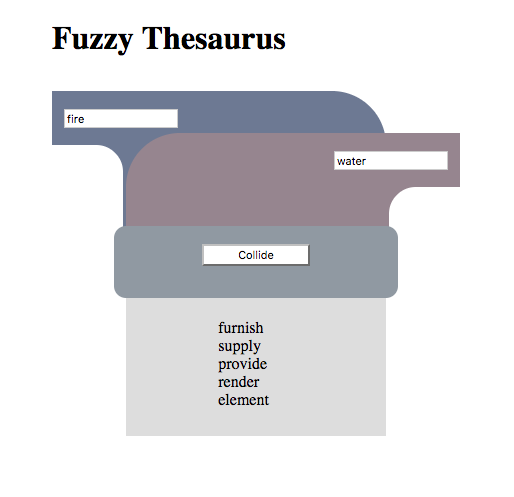

# Three Short Words



## Premise

I often find online thesauri to be frustrating because every word generates a huge number of synonym results, with the same words each occuring several times in different tenses and contexts. Usually when I use a thesaurus I have some addition information about the meaning or context that I am going for, but no way to include it in the search. This is an early prototype of a more flexible thesaurus that looks for the intersection of two words.

## Live

http://www.threeshortwords.com

## Deployment Instructions

### Get a WordsAPI key

Currenntly this app is set kup to use the WordsAPI(www.wordsapi.com) as its reference, which requires the server to submit an API key. [API keys are available through the Mashape Marketplace.](https://market.mashape.com/wordsapi/wordsapi/pricing) They are free for up to 2500 API calls per day but do require a credit card to set up.

Add the API key to an environment variable

```
echo 'export WORDS_API_KEY="your individual api key"' >> ~/.bashrc
source ~/.bashrc
```
### Setup Server

```
git clone https://github.com/rasnom/threeshortwords.git
cd threeshortwords
bundle install 
rails db:create
rails db:migrate
rails server
```

## Tech Stack

* Ruby (2.3.1)
* Rails (5.1.3)
* [WordsAPI](www.wordsapi.com)

## Next Steps

* Remove database for now
* Contextual Routing
* API
* Refactor for cleanliness
* Second draft layout and styling
* Broaden scope of API calls if necessary (add more fuzzyness until you get a reasonable set of results)
* Cache API call results

## Licensing

This project is licensed under [MIT license](./LICENSE)
